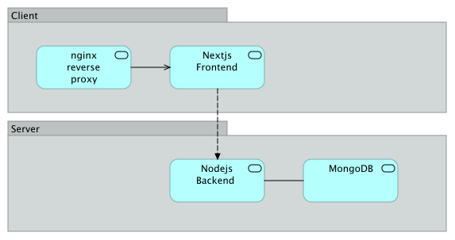
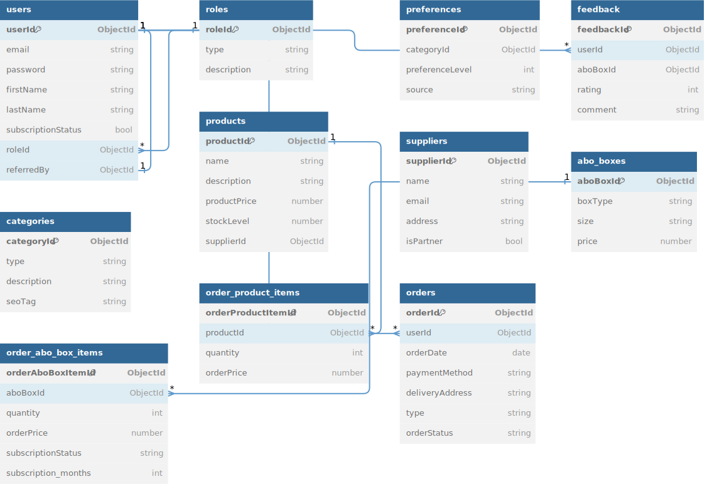

# WS2023 DigOek SustainaBox

# Description of the company

In an ever-changing world where awareness of environmental protection and sustainability is increasing, the company SustainaBox GmbH offers users a subscription box model for carefully selected environmentally friendly products arranged in boxes. The company offers sustainable household goods, zero-waste products, organic food and eco-friendly fashion to create awareness about sustainable use of the products.

# Architecture Diagram

Below is the high-level architecture of the SustainaBox application, illustrating how the services interact within the system.



### Nginx Reverse Proxy
- **Purpose**: Manages HTTPS requests and acts as a security buffer and load balancer.

### Next.js React Frontend
- **Routing**: Utilizes a page-based router for clean URLs and navigation.
- **Communication**: Interfaces with the backend through RESTful calls and GraphQL queries/mutations.

### Node.js TypeScript Backend
- **REST API**: Provides a list of RESTful endpoints
- **Swagger Docs**: API structure and testing is available at the `http://localhost:5000/api-docs` endpoint.
- **GraphQL**: GraphQL schema and endpoint accessible at `http://localhost:5000/graphql`.
- **Startup Routine**: Performs schema validation and preloads datasets upon server start.

### MongoDB
- **Collections**: Stores data across various collections with defined schemas, see ERD below
- **Data Management**: Manages data insertion, indexing strategies, and data constraints.

Below is an RDBM architecture which influenced the design of the mongodb collections



## Use-Cases

The database is already filled with predefined data. The credentials of the respective users are as follows

Customer
```
email: user@example.com
pw: password
```

Supplier
```
email: supplier@example.com
pw: password
```

Admin
```
email: admin@example.com
pw: password
```

### Use-Case 1:

This is the B2C/B2B interface to customers, suppliers, admin. The stakeholders are able to register and log in to the system. This process supports further authentication and authorization. In this step, it is also possible for the customer to place orders for the respective products as a customer.

The detailed process for a new customer is described below.

1) Registration under `https://localhost/signup`  for new customers.
2) Authentication under `https://localhost/login`
3) Selection of preferred product orders in the dashboard `https://localhost/dashboard/user`
4) Confirmation of the purchase process at `https://localhost/dashboard/user/orders/submit`. Any `strings` can be entered as payment method and address
5) The customer gets redirected to `https://localhost/dashboard/user/orders` to see the orders, which are currently pending since they need to accepted by a service employee
6) In order for the customer to receive feedback on the boxes delivered, the order must be accepted by the contract department and the subscription status must be set to active. To do this, we send a request to the corresponding interface with the order. The order can be found under `http://localhost:5000/api/orders`. The order can for example, be as follows

```json
{
  "_id": "65a042af2a219134e31c4021",
  "userId": "65a041922a219134e31c4020",
  "orderDate": "2024-01-11T19:34:07.470Z",
  "paymentMethod": "Paypal",
  "deliveryAddress": "123 Main St, Anytown, AT 12345",
  "type": "aboBox",
  "orderStatus": "pending",
  "items": [
    {
      "aboBoxId": "6580cf9fe98f20fa5d10960e",
      "quantity": 1,
      "orderPrice": 36.98,
      "subscriptionStatus": "pending",
      "subscription_months": 6
    },
    {
      "aboBoxId": "6580cf9fe98f20fa5d109610",
      "quantity": 1,
      "orderPrice": 79.99,
      "subscriptionStatus": "pending",
      "subscription_months": 6
    }
  ]
}
```

The order is then adjusted with a PUT request at `http://localhost:5000/api-docs/#/orders/put_api_orders_boxes__id_`

The ID of the order must be specified as a request parameter. In our example this is `65a042af2a219134e31c4021` and as a request body the orderStatus and the subscriptionStatus are adjusted

```json
{
  "userId": "65a041922a219134e31c4020",
  "orderDate": "2024-01-11T19:34:07.470Z",
  "paymentMethod": "Paypal",
  "deliveryAddress": "123 Main St, Anytown, AT 12345",
  "type": "aboBox",
  "orderStatus": "completed",
  "items": [
    {
      "aboBoxId": "6580cf9fe98f20fa5d10960e",
      "quantity": 1,
      "orderPrice": 36.98,
      "subscriptionStatus": "active",
      "subscription_months": 6
    },
    {
      "aboBoxId": "6580cf9fe98f20fa5d109610",
      "quantity": 1,
      "orderPrice": 79.99,
      "subscriptionStatus": "active",
      "subscription_months": 6
    }
  ]
}
```

The page can then be reloaded at `https://localhost/dashboard/user/orders`. The customer now sees the respective orders for which a feedback process has been started.

The product reviews can be accessed at `http://localhost:5000/api/feedback`.

### Use-Case 2:

Customers can adjust their respective preferences for the subscription boxes. This can be done at `https://localhost/dashboard/user/profile`. If a customer changes preferences, the logout process is started under `/logout`. You must log in again here so that the updated probabilities for the preferred subscription boxes are reloaded. After logging in again, the customer is shown the subscription boxes that best suit their preferences

### Use-Case 3: Supplier Functionalities
In this use-case we showcase the suppliers ability to register, add products, and change the stock level of products:
Before getting started, make sure that no user is logged in. 
1) Create a supplier user: The supplier can be created using the UI. For this, click on the "Get started as a Supplier" Button on the top right corner of the landing page (https://localhost). After entering the supplier information, a supplier user will be created (visible in the MongoDB database)
2) Login using the supplier credentials by clicking on the "Log in" Button on the top right corner of the landing page. After logging in, the supplier dashboard will be loaded. 
3) A supplier can add a new product, by clicking on "Add Product" on the supplier dashboard. After entering the product specifications, the new product should be visible on the supplier dashboard.
4) The supplier can adapt the stock level of a product by clicking on the "..." Button of the product and selecting "Change Stock". After entering the new stock level, the new amount should be visible on the supplier dashboard.
### Use-Case 4: Admin Functionalities
In this use-case we demonstrate the funtionalities of the admin (their ability to monitor product and reorder of necessary) as well as the visualization of the supplier product trends.
Before getting started, make sure an admin user is available. An admin user can only be created by either manually entering a dataset into the MongoDB database, or using the GraphQL endpoint. For creating an admin User using the GraphQL endpoint, the following a mutation query must be sent to the GraphQL endpoint (localhost:5000/graphql) either using the built in interface which will be loaded in the Browser of navigated to the endpoint url, or using thir-party services (e.g. Postman). An example of the mutation query:
```json
mutation CreateUser {
    createUser(
        input: {
            email: "admin2@gmail.com"
            password: "123456"
            firstName: "Danial"
            lastName: "Amlashi"
            subscriptionStatus: false
            role: { type: "admin" }
        }
    ) {
        _id
        email
        password
        firstName
        lastName
        subscriptionStatus
        referredBy
    }
}
```
If the user is created, the response of the query will be the following:
```
{
    "data": {
        "createUser": null
    }
}
```
After creating a admin user, the use-case can be tested using the following steps:
1) Login using the admin credentials by clicking on the "Log in" button on the landing page. After loggin in, the admin dashboard should appear. 
2) The admin can monitor the stock levels of all products available in the system. If a product is running low on stock, the admin has the ability to reorder a product directly by clicking on the "..." button of the product and selecting "Order Products". After selecting the amount of order, an order will be created in the database.
3) The supplier dashboard offers the supplier the ability to monitor the order trends of their products. This is done by visualizing the sum amount of orders a product has appeard in. For this functionality, log out from the admin account and log in as the supplier (preferably a supplier, whos product has been ordered). 
4) On the supplier dashboard, navigate to the "Trends" tab on the left side. After selecting the Time frame, click on "Generate Chart". This will generate a simple bar chart containing the products of the supplier, as well as the order amount. 
